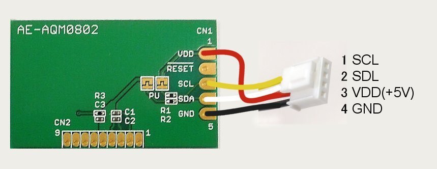

# MSX0 Sample program : I2C Character LCD

秋月電子扱いのI2C Character LCD AQM0802AをMSX0で使えるつかった
MSX0 サンプルプログラムです。Cコンパイラーはz88dk用です。
I2Cのコードは、libiot.cの一部関数を参照にさせていただいています。

MITライセンスなので、ご自由にお使いください。


## ■ 対応I2C Character LCD
秋月電子扱いのI2C液晶AQM0802Aに初期設定を合わせています。  
https://akizukidenshi.com/catalog/g/gK-06795/

## ■ 結線図
  
PUジャンパの設定は不要です。  
コードの色はモノによって異なる場合があります。その場合は読み替えてください。  

## ■ ざっくりした使い方
MSXDOS上で下記のコマンドを打ち込むとLCD上に文字が出ます。
```
>I2CLCD.COM [表示したいCharacter]
```
## ■ プログラムのコンパイル方法
コンパイルにはz88dkを使用しています。  
標準Libraryしか使用していないので、z88dkのコンパイル環境があれば再コンパイル可能なはずです。  
コンパイルはcc.batを実行してください。MSX-DOS形式の実行ファイルとディスクイメージが生成されます。

## ■ MSX0でのGrove IOポート
旧Version用なので新Versionでは下記定義を書き換えてください。

```
// IOT命令で使われるIOポート  
#define IOT_PORT 8
```

## ■ MSX0でのI2Cのデバイスパスについて
下記定義を変更してください。
```
// MSX0における、I2Cのデバイスパス  
#define I2CADDR_LCD "device/i2c_a/3E"  
```
## ■ 関数解説
### IOT用関数

I2C出力関数：I2Cにlenのサイズ分データを出力する    
```
char iotputs_n(char *device_path, char *value, int len)
```
### LCDの制御関数

LCDへの文字データ書き込み関数：LCDへ表示データ書き込みます。
```
void lcdWrite(unsigned char dat)
```

LCDへのコマンド書き込み関数：LCDへ制御データを書き込みます。
```
void lcdCommand(unsigned char dat)
```

LCD表示クリア関数：LCDの表示をクリア
```
void lcdClear(void)
```

LCD表示位置設定関数：LCDのカーソルを設定値まで移動します。　※未使用
```
void lcdsSetCursor(unsigned char col, unsigned char row)
```

LCD初期化関数：LCDを使う為の初期化コマンドを送信します。
```
void lcdBegin(void)
```

LCDへの文字列表示関数：カーソル位置から文字列を表示します。
```
void lcdStr(char *c)
```
